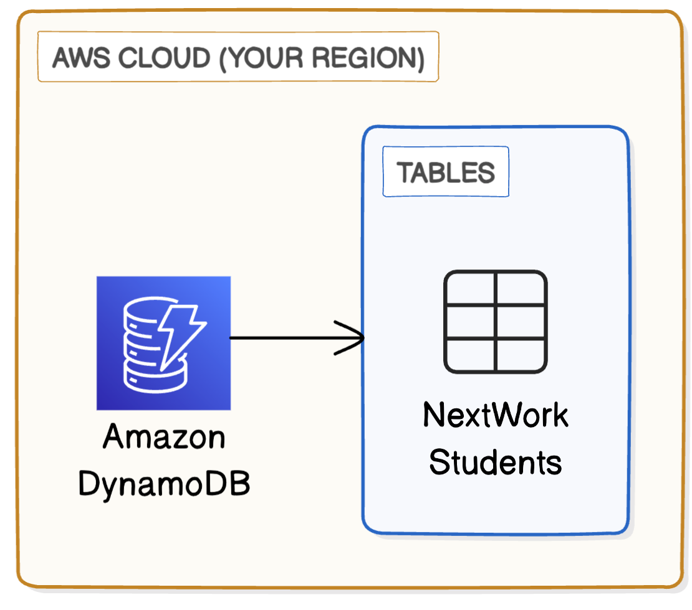
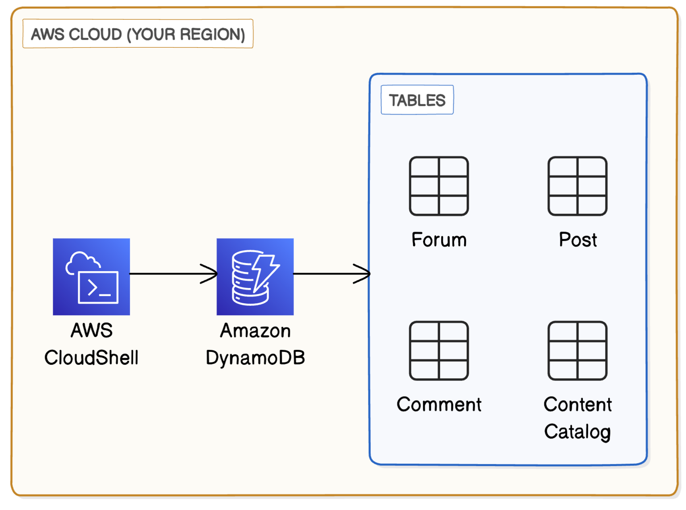
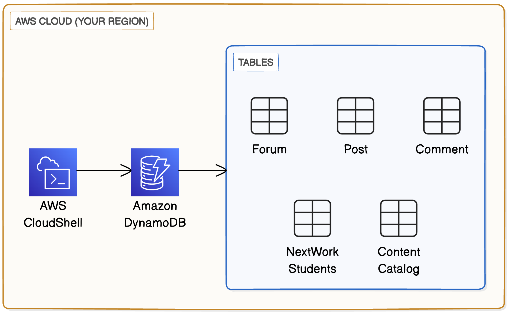
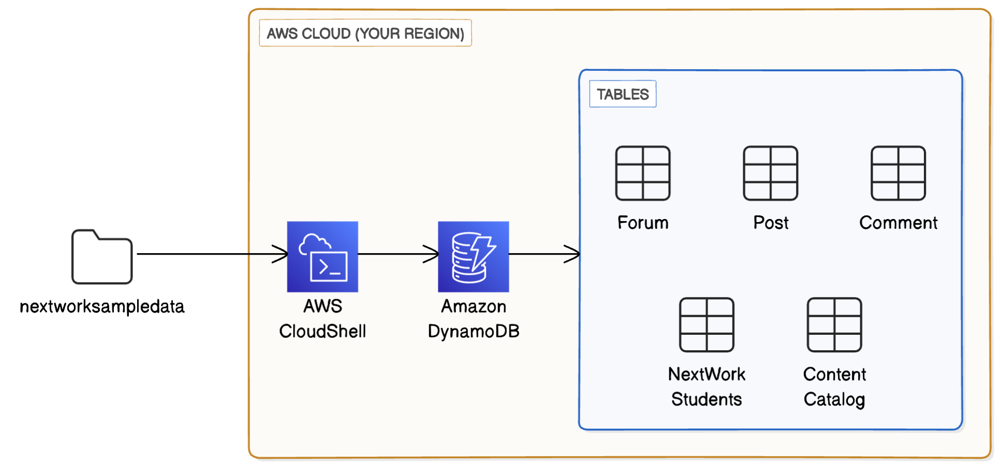
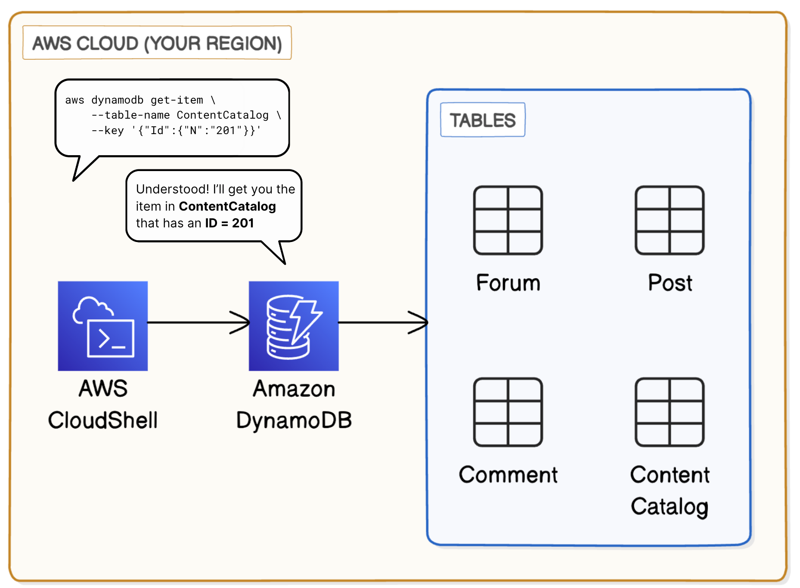
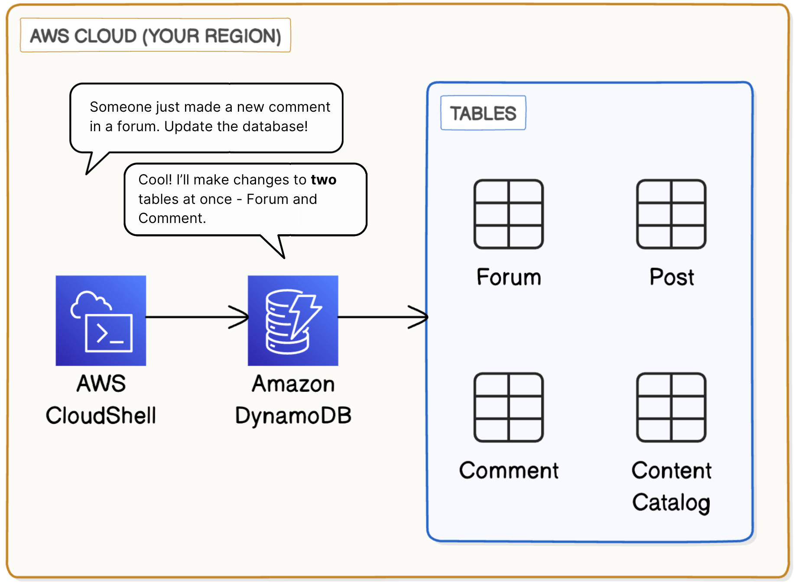

# AWS DynamoDB Data Engineering

This project explores Amazon DynamoDB through a practical, end to end workflow that reflects real data engineering tasks. The goal was to design a complete NoSQL environment, create tables, load structured and semi structured data, and query that data using both the AWS Console and AWS CloudShell. By working with multiple related datasets such as Projects, Videos, Forums, Posts, and Comments, I was able to see how DynamoDB handles flexible schemas and how access patterns influence table design.

Throughout the project, I created tables programmatically, loaded data using batch operations, and queried items using partition keys, sort keys, and projection expressions. I also worked with DynamoDB consistency models and capacity settings, and implemented a transaction to update multiple tables at once.

This project highlights DynamoDB strengths as a scalable NoSQL database and reinforces core data engineering skills including data modeling, CLI automation, and working with cloud native database services.

---

## Project Overview

- The project began by creating all DynamoDB tables using both the AWS Console and AWS CloudShell. This helped reinforce how partition keys, sort keys, and capacity settings define the structure and performance of each table.
- After the tables were created, the sample datasets were downloaded, reviewed, and loaded into DynamoDB using batch write operations through the AWS CLI.
- Once the data was loaded, the tables were explored in the DynamoDB console to understand how items and attributes are stored and how DynamoDB supports flexible schemas across different content types.
- A series of queries were performed using both the console and the AWS CLI. These included retrieving specific items, selecting individual attributes, filtering results, and comparing eventual and strong consistency.
- The project also included a transaction that created a new comment and updated the related forum item in a single atomic operation. This demonstrated how DynamoDB maintains consistency across related data without relying on a traditional relational schema.
- Completing the project provided practical experience with DynamoDB table design, data loading, querying, and transactional updates, while reinforcing the importance of data modeling and understanding access patterns in NoSQL systems.

---

## Workflow Diagrams

### Creating the initial DynamoDB table in the AWS Console

### Creating DynamoDB tables using AWS CloudShell

### Verifying table creation and reviewing table settings

### Loading data into DynamoDB using AWS CLI batch write operations

### Querying DynamoDB tables using AWS CLI commands

### Running a DynamoDB transaction to update multiple tables in a single operation

---

## Skills Demonstrated

- Designing NoSQL data models that align with DynamoDB access patterns and table structure
- Creating DynamoDB tables through both the AWS Console and AWS CloudShell
- Loading structured and semi structured data using AWS CLI batch write operations
- Querying data with partition keys, sort keys, filters, and projection expressions
- Comparing eventual and strong consistency models in DynamoDB
- Running transactional operations to update related items in a single atomic action
- Navigating the DynamoDB console to inspect items, attributes, and schema flexibility
- Working with cloud native tooling to automate database operations
- Understanding how data flows through a NoSQL system from creation to querying and updates

---

## Services, Technologies, and Tools Used

- Amazon DynamoDB for NoSQL data storage and querying
- AWS Console for table creation and data inspection
- AWS CloudShell for running AWS CLI commands
- AWS CLI for creating tables, loading data, and performing queries
- JSON datasets for loading sample content into DynamoDB
- Cloud based development environment for testing and validating operations
- GitHub for version control and project documentation

---